# Unlocked! 🔓
## Web Scraping with GIL-Free Python 3.14

Making Python faster by removing the training wheels

---

# What We'll Cover

1. **What is web scraping?** And why it's slow
2. **The async solution** - Doing multiple things at once
3. **The GIL problem** - Python's speed limit
4. **The GIL-free future** - Python 3.14's superpower
5. **Live demos!** Seeing the difference in action

---

# Part 1: Web Scraping Basics 🕷️

## What is web scraping?

Extracting data from websites programmatically:
- Fetch a web page (HTML)
- Parse the content (extract what you need)
- Often: follow links to more pages
- Repeat hundreds or thousands of times

---

# A Simple Example

```python
import requests
from bs4 import BeautifulSoup

# Fetch one page
response = requests.get("https://news.ycombinator.com")
html = response.text

# Parse it
soup = BeautifulSoup(html, "html.parser")
stories = soup.select(".athing")

print(f"Found {len(stories)} stories")
```

---

# The Problem: It's Slow! 🐌

Scraping **100 pages** one at a time:

```python
for page_num in range(1, 101):
    url = f"https://example.com/page/{page_num}"
    html = fetch(url)  # Wait... wait... wait...
    data = parse(html)
    save(data)
```

**Why?** You're waiting for the network on every request!
- Each page takes ~1 second
- 100 pages = 100 seconds
- Most of that time: **waiting** 😴

---

# Sequential Scraping Flow


---

# Part 2: Enter Asyncio ⚡

## The callback nature of web scraping

Web scraping is naturally asynchronous:
1. "Fetch this page, **when it arrives**, parse it"
2. "The page has 30 links, **when each link loads**, extract data"
3. "Keep going until **all pages are done**"

Perfect for `async`/`await`!

---

# Async Web Scraping

```python
import aiohttp
import asyncio

async def fetch(url):
    async with aiohttp.ClientSession() as session:
        async with session.get(url) as response:
            return await response.text()

async def scrape_many():
    # Fetch 10 pages at the same time!
    urls = [f"https://example.com/page/{i}" for i in range(10)]
    tasks = [fetch(url) for url in urls]
    results = await asyncio.gather(*tasks)
    return results

asyncio.run(scrape_many())
```

**Result:** Much faster! ⚡

---

# How Much Faster?

Instead of:
```
Page 1: [====] 1s
Page 2: [====] 1s
Page 3: [====] 1s
Total: 3 seconds
```

We get:
```
Page 1: [====]
Page 2: [====]  1s total
Page 3: [====]
```

**10x-100x faster** for I/O-bound work!

---

# Async Scraping Flow


---

# Part 3: But There's a Catch... 🔒

## The Global Interpreter Lock (GIL)

Python has a "lock" that prevents multiple threads from running Python code at the same time.

**Why does it exist?**
- Memory management safety
- Simplifies Python's internals
- Been around since 1992!

---

# The GIL in Action

Even with multiple CPU cores:

```
Core 1: [Python][wait][Python][wait]...
Core 2: [wait][Python][wait][Python]...
Core 3: [wait][wait][Python][Python]...
Core 4: [idle][idle][idle][idle]...

Only ONE core runs Python at a time!
```

For **CPU-bound** work, multithreading doesn't help much. 😞

---

# GIL Architecture

```mermaid
graph TB
    subgraph "Multi-Core CPU"
        C1[Core 1]
        C2[Core 2]
        C3[Core 3]
        C4[Core 4]
    end

    GIL[🔒 Global Interpreter Lock]

    subgraph "Python Threads"
        T1[Thread 1]
        T2[Thread 2]
        T3[Thread 3]
    end

    T1 -.wants to run.-> GIL
    T2 -.wants to run.-> GIL
    T3 -.wants to run.-> GIL

    GIL -->|allows only ONE| T1
    T1 --> C1

    style GIL fill:#f96,stroke:#333,stroke-width:4px
    style T1 fill:#9f6,stroke:#333
    style T2 fill:#ccc,stroke:#333
    style T3 fill:#ccc,stroke:#333
```



---

# The GIL and Web Scraping

**Good news:** The GIL is released during I/O operations!
- While waiting for network → other threads can run
- Some parallelism is possible

**Bad news:** Parsing HTML is CPU-bound work
- BeautifulSoup parsing → held by GIL
- Multiple threads, but serialized parsing

**Result:** Better than single-threaded, but not true parallelism

---

# Performance with GIL

From our demo (12-core CPU):

| Configuration         | Stories/sec | Speedup |
| --------------------- | ----------- | ------- |
| Single thread         | ~12         | 1x      |
| Multi-threaded        | ~35         | ~3x     |

Better, but **we have 12 cores!** We should do better! 💪

---

# Part 4: GIL-Free Python 3.14 🎉

## The Future is Here!

Python 3.13+ introduces **free-threading mode**:
- Experimental feature (PEP 703)
- Run Python code in **true parallel**
- Use all CPU cores simultaneously!

```bash
python -X gil=0 script.py
```

That's it! The GIL is disabled. ✨

---

# How It Works

Without GIL:

```
Core 1: [Python][Python][Python][Python]
Core 2: [Python][Python][Python][Python]
Core 3: [Python][Python][Python][Python]
Core 4: [Python][Python][Python][Python]

All cores running Python simultaneously! 🚀
```

---

# GIL-Free Architecture


---

# GIL-Free Performance

From our demo (12-core CPU):

| Configuration                      | Stories/sec | Speedup |
| ---------------------------------- | ----------- | ------- |
| Single thread                      | ~12         | 1x      |
| Multi-threaded (with GIL)          | ~35         | ~3x     |
| Multi-threaded (GIL-free) 🌟       | **~80**     | **~7x** |

**Nearly 7x faster!** Now we're talking! 🔥

---

# Why Such a Big Difference?

Web scraping has **both** I/O and CPU work:

**I/O work:** Fetching pages over network
- GIL is released → some parallelism

**CPU work:** Parsing HTML with BeautifulSoup
- With GIL → serialized (one at a time)
- **Without GIL → true parallel parsing!**

Result: All cores busy with real work! 💪

---

# Web Scraping Workflow


The callback nature: fetch → parse → follow links → repeat!

---

# Part 5: Live Demo Time! 🎬

Let's see it in action!

Our demo scrapes Hacker News:
- 100 pages of stories
- Each story's comment page
- Hundreds of pages total

Three configurations to compare...

---

# Demo 1: Single-Threaded

```bash
python scraper.py
```

One async event loop, one core.

**Baseline performance** 📊

---

# Demo 2: Multi-Threaded (With GIL)

```bash
python scraper.py --multithreaded
```

8 threads, each with async event loop.
GIL limits true parallelism.

**Some improvement** 📈

---

# Demo 3: Multi-Threaded (GIL-Free)

```bash
python -X gil=0 scraper.py --multithreaded
```

8 threads, no GIL restrictions.
True parallelism across all cores!

**Maximum performance!** 🚀

---

# The Code: Key Patterns

```python
async def worker(queue, all_stories):
    """Each worker processes pages from a shared queue"""
    async with aiohttp.ClientSession() as session:
        while True:
            page = queue.get()  # Get next page
            html = await fetch(session, page)  # I/O: fetch
            stories = parse_stories(html)  # CPU: parse

            # Follow links: the callback pattern!
            async with asyncio.TaskGroup() as tg:
                for story in stories:
                    tg.create_task(
                        fetch_story_with_comments(session, story)
                    )
```

---

# Threading Strategy

```python
def main(multithreaded: bool):
    queue = Queue()  # Shared work queue
    all_stories = []  # Shared results

    if multithreaded:
        # Each thread runs its own event loop
        with ThreadPoolExecutor(max_workers=8) as executor:
            for _ in range(8):
                executor.submit(
                    lambda: asyncio.run(worker(queue, all_stories))
                )
    else:
        # Single event loop
        asyncio.run(worker(queue, all_stories))
```

---

# Key Takeaways 🎯

1. **Async is great for I/O** - Don't wait, do multiple things!
2. **The GIL limits CPU parallelism** - But it's being released during I/O
3. **GIL-free Python changes the game** - True multi-core parallelism
4. **Web scraping benefits hugely** - Mix of I/O + CPU work
5. **The callback nature fits async perfectly** - Follow links naturally

---

# When to Use GIL-Free Python?

**Great for:**
- Web scraping (as we saw!)
- Data processing pipelines
- API servers with CPU-heavy requests
- Any mixed I/O + CPU workload

**Not needed for:**
- Pure I/O work (async alone is fine)
- Single-threaded applications
- CPU-bound tasks (use multiprocessing)

---

# Getting Started

```bash
# Install Python 3.14 (or 3.13 with experimental support)
# Using pyenv:
pyenv install 3.14.0

# Your async code stays the same!
# Just add the flag:
python -X gil=0 your_script.py
```

That's it! No code changes needed! ✨

---

# Resources 📚

- **PEP 703:** Making the GIL Optional
- **Python 3.13+ Docs:** Free-threading mode
- **This demo:** github.com/[your-repo]/unlocked_scraper
- **aiohttp docs:** Async HTTP library
- **BeautifulSoup docs:** HTML parsing

---

# Questions? 🤔

Try it yourself:
1. Clone the demo repo
2. Run the three configurations
3. See the performance difference!

**Thank you!** 🎉

Slides: [QR code here]
Code: github.com/[your-repo]/unlocked_scraper
